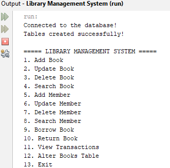
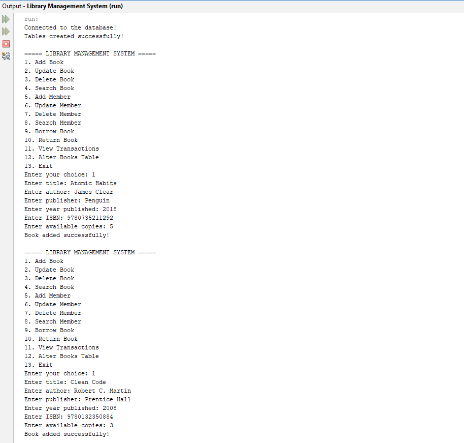
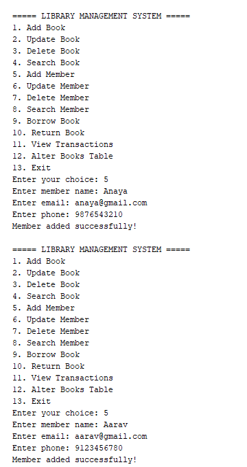
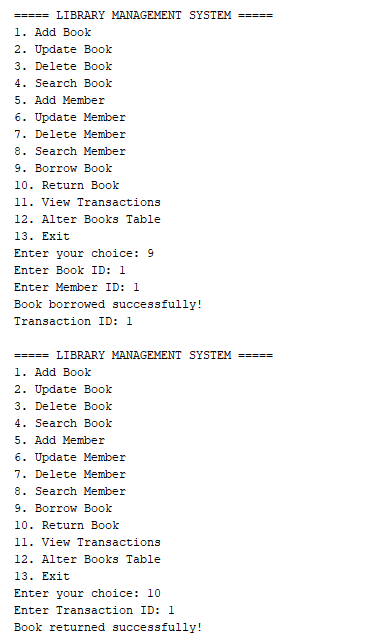
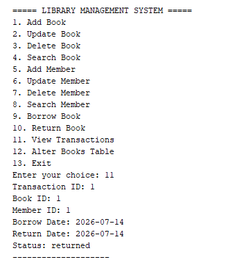

# JDBC Library Management System

A console-based Library Management System developed using **Java**, **JDBC**, and **MySQL**. The application demonstrates CRUD operations, SQL queries, PreparedStatements, foreign key relationships, and transaction management for a library database.

---

## Application Screenshots

### Main Menu



---

### Adding Books and Members



---



---

### Borrowing and Returning Books



---

### Viewing Transactions



## Features

### Books Management
- Add new books
- Update existing book details
- Delete books (prevents deletion if transaction history exists)
- Search books by title, author, or ISBN

### Members Management
- Add new members
- Update member information
- Delete members
- Search members by name or email

### Transactions Management
- Borrow books
- Return books
- Automatically records borrow date
- Automatically records return date
- Automatically updates transaction status
- Automatically decreases available copies when borrowing
- Automatically increases available copies when returning
- Prevents borrowing when no copies are available
- View all transactions

### Database Features
- Automatically creates database tables (if they do not exist)
- Uses Primary Keys and Foreign Keys
- Demonstrates SQL CRUD operations
- Uses both Statement and PreparedStatement
- Uses ResultSet for retrieving records

---

## Technologies Used

- Java
- JDBC
- MySQL
- MySQL Connector/J
- Apache NetBeans IDE

---

## SQL Concepts Used

- CREATE TABLE
- INSERT
- SELECT
- UPDATE
- DELETE
- ALTER TABLE
- PRIMARY KEY
- FOREIGN KEY
- AUTO_INCREMENT
- CURDATE()
- COUNT()

---

## Java Concepts Used

- Object-Oriented Programming
- Exception Handling
- Loops
- Switch Case
- JDBC API
- Statement
- PreparedStatement
- ResultSet
- Scanner Class

---

## Project Structure

```text
Library Management System
│
├── Screenshots
│   ├── main-menu.png
│   ├── add-book.png
│   ├── add-member.png
│   ├── borrow-return.png
│   └── view-transactions.png
│
├── src
│   └── library
│       └── management
│           └── system
│               └── LibraryManagementSystem.java
│
├── test
│
├── nbproject
│
├── build.xml
├── manifest.mf
├── librarydb.sql
├── README.md
└── .gitignore
```

## Database Schema

### Books

| Column | Type |
|---------|------|
| book_id | INT (Primary Key, AUTO_INCREMENT) |
| title | VARCHAR(100) |
| author | VARCHAR(100) |
| publisher | VARCHAR(100) |
| year_published | INT |
| isbn | VARCHAR(50) |
| available_copies | INT |

---

### Members

| Column | Type |
|---------|------|
| member_id | INT (Primary Key, AUTO_INCREMENT) |
| name | VARCHAR(100) |
| email | VARCHAR(100) |
| phone | VARCHAR(20) |
| membership_date | DATE |

---

### Transactions

| Column | Type |
|---------|------|
| transaction_id | INT (Primary Key, AUTO_INCREMENT) |
| book_id | INT (Foreign Key) |
| member_id | INT (Foreign Key) |
| borrow_date | DATE |
| return_date | DATE |
| status | VARCHAR(20) |

---

## Database Setup

Open **MySQL Workbench** and execute:

```sql
CREATE DATABASE librarydb;
```

Use the database:

```sql
USE librarydb;
```

The application automatically creates the required tables when executed.

---

## Configuration

Update the following variables before running the project:

```java
static final String url =
        "jdbc:mysql://localhost:3306/librarydb";

static final String user = "root";

static final String password = "YOUR_PASSWORD";
```

Replace `YOUR_PASSWORD` with your MySQL root password.

---

## How to Run

1. Clone the repository.

```bash
git clone https://github.com/larpita/jdbc-library-management-system.git
```

2. Open the project in Apache NetBeans.

3. Add **MySQL Connector/J** to the project libraries.

4. Create the database:

```sql
CREATE DATABASE librarydb;
```

5. Update the database credentials in the Java file.

6. Run:

```
LibraryManagementSystem.java
```

---

## Sample Menu

```
===== LIBRARY MANAGEMENT SYSTEM =====

1. Add Book
2. Update Book
3. Delete Book
4. Search Book
5. Add Member
6. Update Member
7. Delete Member
8. Search Member
9. Borrow Book
10. Return Book
11. View Transactions
12. Alter Books Table
13. Exit
```

---

## Business Rules Implemented

- Books cannot be borrowed if available copies are zero.
- Returning a book automatically increases the available copies.
- Borrow date is automatically set using `CURDATE()`.
- Return date is automatically updated on return.
- Transaction status changes automatically from **borrowed** to **returned**.
- Books with transaction history cannot be deleted.
- Foreign key constraints maintain database integrity.

---

## Learning Outcomes

Through this project, I gained hands-on experience with:

- Java Database Connectivity (JDBC)
- MySQL database design
- SQL CRUD operations
- Statement and PreparedStatement
- ResultSet processing
- Foreign Key relationships
- Transaction management
- Exception handling
- Console-based application development

---


